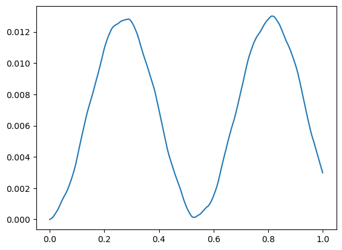

```python
import PlotLinearSolverResult.read_from_hdf5 as rh
import matplotlib.pyplot as plt
import numpy as np

```


```python
f = rh.H5File('test_write_vibration_characteristics.h5')
```


```python
f.print_directory_information()
```

    ├──Animation
       └──Index
          ├──Ground
             └──Frame
          └──Part_Beam
             ├──Frame
             └──Part_BeamNodes
    ├──Curve
       └──Index
          ├──Ground
             └──Markers
                └──Marker_0
          └──Part_Beam
             └──Nodes
    ├──ModalInformation
       ├──Index
          ├──Ground
             └──Frame
          └──Part_Beam
             ├──Frame
             └──Part_BeamNodes
       ├──NaturalFrequencies
       └──SystemModalMass
    └──TimeStamps
    


    [[[['/Animation/Index/Ground/Frame'],
       ['/Animation/Index/Part_Beam/Frame',
        '/Animation/Index/Part_Beam/Part_BeamNodes']]],
     [[[['/Curve/Index/Ground/Markers/Marker_0']], [[]]]],
     [[['/ModalInformation/Index/Ground/Frame'],
       ['/ModalInformation/Index/Part_Beam/Frame',
        '/ModalInformation/Index/Part_Beam/Part_BeamNodes']],
      '/ModalInformation/NaturalFrequencies',
      '/ModalInformation/SystemModalMass'],
     '/TimeStamps']


```python
keys = f.get_keys_attrs_dset('/Animation/Index/Part_Beam/Part_BeamNodes')
keys[5]
```


    'PhysicalDisplacementY'


```python
index = f.get_index_attr_dset_in_datas('/Animation/Index/Part_Beam/Part_BeamNodes',keys[5])
```


```python
animation_datas = f.get_animation_datas()
```


```python
times = f.get_TimeStamps()
```


```python
plt.plot(times,animation_datas[:,index[0]])
```


    [<matplotlib.lines.Line2D at 0x1ef4062c8d0>]


    

    


```python

```
